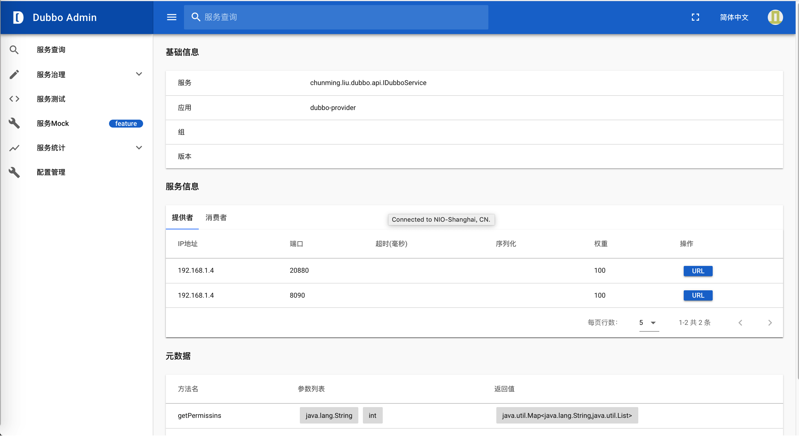

> 这是一个基于spring+dubbo开发的小demo。主要用于学习基于spring+dubbo框架的开发流程。用将此项目作为学习使用python进行dubbo接口测试的服务端程序。

# 1. 创建Dubbo项目
## 1.1 使用Maven创建多模块项目
因为这是一个demo项目，我希望将dubbo provider和comsumer都放到一个工程中方便管理。所以我这里创建了一个Maven多模块工程。操作步骤如下：
1. 打开IntelliJ IDEA——>
2. File——>New——>Project——>
3. Maven——>
4. 不要勾选Create from archetype——>Next——>
5. 输入groupId（chunming.liu）和artifactId（dubbo-demo）——>Next——>
6. 设置项目名称dubbodemo——>Finished
7. 这样我们就创建好了一个普通项目，因为该项目是作为一个Parent project存在的，可以直接删除src文件夹。

## 1.2 创建dubbo-api子项目
dubbo-api用来存放公共接口，在dubbo-provider和dubbo-consumer上都会用到。

在dubbodemo项目上，点击右键，创建一个Model（该模块即为子项目），不要勾选Create from archetype——>Next，输入artifactId（dubbo-api）——>Next——>Finished。

在dubbo-api子项目中创建package（chunming.liu.dubbo.api），其中创建interface类IDubboService：
```java
public interface IDubboService {
    public Map<String, List> getPermissins(String id, int count);
}
```

## 1.3 创建dubbo-provider子项目
参考1.2小节，创建dubbo-provider子项目。

在项目中创建pacakge（chunming.liu.dubbo.provider），在其中创建DubboServiceImpl类，实现1.2中的公共接口IDubboService。代码如下：
```java
public class DubboServiceImpl implements IDubboService {
    public Map<String, List> getPermissins(String id, int count) {
        List<String> demo = new ArrayList<>();
        Map<String,List> response = new HashMap<>();
        for (int i = 0; i < count; i++) {
            demo.add(String.format("Permission_%s", id + i));
        }
        response.put("permissions",demo);
        return response;
    }
}
```
dubbo-provider子项目的pom文件中加入公共接口所在的依赖包。
```xml
<dependency>
            <groupId>chunming.liu</groupId>
            <artifactId>dubbo-api</artifactId>
            <version>1.0-SNAPSHOT</version>
        </dependency>
```
用Spring配置声明暴露服务，在dubbo-provider子项目的resources目录下，创建META-INF/spring目录，并在其中创建 Spring 的核心配置文件 applicationContext，起名叫创建 Spring 的核心配置文件 dubbo-provider-applicationContext.xml。
```xml
<?xml version="1.0" encoding="UTF-8"?>
<beans xmlns="http://www.springframework.org/schema/beans"
       xmlns:xsi="http://www.w3.org/2001/XMLSchema-instance"
       xmlns:dubbo="http://code.alibabatech.com/schema/dubbo"
       xsi:schemaLocation="http://www.springframework.org/schema/beans
       http://www.springframework.org/schema/beans/spring-beans.xsd
       http://code.alibabatech.com/schema/dubbo
       http://code.alibabatech.com/schema/dubbo/dubbo.xsd">
    <!--定义了提供方应用信息，用于计算依赖关系；在 dubbo-admin 或 dubbo-monitor 会显示这个名字，方便辨识-->
    <dubbo:application name="dubbo-provider" owner="chunming" organization="liu"/>
    <!--使用 zookeeper 注册中心暴露服务，注意要先开启 zookeeper-->
    <dubbo:registry address="zookeeper://localhost:2181" timeout="3000"/>
    <!-- 用dubbo协议在20880端口暴露服务 -->
    <dubbo:protocol name="dubbo" port="20880" />
    <dubbo:service interface="chunming.liu.dubbo.api.IDubboService" ref="dubboService" protocol="dubbo" />
    <!--增加hessian协议，如果设置server="servlet",则需要web容器支持,我们的provider是以jar方式运行的，所以用jetty-->
    <dubbo:protocol name="hessian" port="20881" server="jetty" contextpath="dubbo-provider"/>
    <dubbo:service interface="chunming.liu.dubbo.api.IDubboService" ref="dubboService" protocol="hessian" />
    <!--具体实现该接口的 bean-->
    <bean id="dubboService" class="chunming.liu.dubbo.provider.DubboServiceImpl"/>
</beans>
```
为了使这个配置生效，需要在dubbodemo项目的pom文件中加入如下依赖：
```xml
<dependencies>
        <dependency>
            <groupId>org.springframework</groupId>
            <artifactId>spring-context</artifactId>
            <version>5.2.7.RELEASE</version>
        </dependency>
        <dependency>
            <groupId>org.apache.dubbo</groupId>
            <artifactId>dubbo</artifactId>
            <version>2.7.8</version>
        </dependency>
        <dependency>
            <groupId>org.apache.zookeeper</groupId>
            <artifactId>zookeeper</artifactId>
            <version>3.6.1</version>
        </dependency>
        <dependency>
            <groupId>org.apache.curator</groupId>
            <artifactId>curator-framework</artifactId>
            <version>4.0.1</version>
        </dependency>
        <dependency>
            <groupId>org.apache.curator</groupId>
            <artifactId>curator-recipes</artifactId>
            <version>4.0.1</version>
        </dependency>
    </dependencies>
```
其实这个依赖加入到dubbo-provider子项目的pom文件中也是可以的。只不过因为这些依赖在dubbo-consumer子项目中也会用到，放到dubbodemo项目的pom文件中之后，就不需要在dubbo-consumer子项目再引用一次了。

现在，就可以编写启动dubbo-provider服务的类了。在chunming.liu.dubbo.provider包中创建Provider类，代码如下：
```java
public class Provider {
    public static void main(String[] args) throws IOException {
        ClassPathXmlApplicationContext context = new ClassPathXmlApplicationContext("META-INF/spring/dubbo-provider-applicationContext.xml");
        context.start();
        System.out.println("服务已经启动了");
        System.in.read();
    }
}
```
至此，dubbo-provider服务就写完了。通过运行Provider类就可以启动服务了。

# 2. 测试Dubbo项目
## 2.1 创建java版客户端
创建一个dubbo-consumer子项目，用来测试dubbo-provider。创建方法也是参考1.2小节。项目的pom文件中加入公共接口所在的依赖包：
```xml
<dependency>
            <groupId>chunming.liu</groupId>
            <artifactId>dubbo-api</artifactId>
            <version>1.0-SNAPSHOT</version>
        </dependency>
```

通过Spring配置引用远程dubbo服务，方法是：在resources目录下创建文件夹META-INF/spring，其中创建Spring框架配置文件dubbo-consumer-applicationContext.xml，内容如下：
```xml
<?xml version="1.0" encoding="UTF-8"?>
<beans xmlns="http://www.springframework.org/schema/beans"
       xmlns:xsi="http://www.w3.org/2001/XMLSchema-instance"
       xmlns:dubbo="http://code.alibabatech.com/schema/dubbo"
       xsi:schemaLocation="http://www.springframework.org/schema/beans
       http://www.springframework.org/schema/beans/spring-beans.xsd
       http://code.alibabatech.com/schema/dubbo
       http://code.alibabatech.com/schema/dubbo/dubbo.xsd">
    <!--定义了提供方应用信息，用于计算依赖关系；在 dubbo-admin 或 dubbo-monitor 会显示这个名字，方便辨识-->
    <dubbo:application name="dubbo-consumer" owner="chunming" organization="liu"/>
    <!--向 zookeeper 订阅 provider 的地址，由 zookeeper 定时推送-->
    <dubbo:registry address="zookeeper://localhost:2181" timeout="3000"/>
    <!--使用 dubbo 协议调用定义好的 api.PermissionService 接口-->
    <!--    因为 name 指定的是传输协议的名称：dubbo rmi hessian webservice （对应常见的传输协议：Dubbo、RMI、Hessain、WebService、Http)-->
    <dubbo:reference interface="chunming.liu.dubbo.api.IDubboService" id="dubboService" />
</beans>
```
编写Consumer.java调用远程dubbo服务的接口：
```java
public class Consumer {
    public static void main(String[] args) {
        ClassPathXmlApplicationContext context = new ClassPathXmlApplicationContext("META-INF/spring/dubbo-consumer-applicationContext.xml");
        context.start();
        System.out.println("客户端已经启动");
        IDubboService dubboService = context.getBean(IDubboService.class);
        System.out.println("消费");
        System.out.println(dubboService.getPermissins("test", 5));  //调用远程dubbo接口
    }
}
```
启动Consumer，将会得到如下输出：
```bash
客户端已经启动
消费
{permissions=[Permission_test0, Permission_test1, Permission_test2, Permission_test3, Permission_test4]}
```
## 2.2 创建Python版客户端
很多同学是使用Python做软件测试的，Python也可以调用远程dubbo接口，代码如下：
```python
import telnetlib


class Dubbo(telnetlib.Telnet):
    prompt = 'dubbo>'
    coding = 'utf-8'

    def __init__(self, host=None, port=0, timeout=3000):
        super().__init__(host, port, timeout)
        self.write(b'\n')

    def command(self, flag, str_=""):
        data = self.read_until(flag.encode())
        self.write(str_.encode() + b"\n")
        return data

    def invoke(self, service_name: str, method_name: str, arg: str):
        command_str = "invoke {0}.{1}({2})".format(service_name, method_name, arg)
        print(command_str)
        self.command(Dubbo.prompt, command_str)
        data = self.command(Dubbo.prompt, "")
        return data.decode(Dubbo.coding, errors='ignore').split('\n')[1].strip()


if __name__ == '__main__':
    conn = Dubbo('127.0.0.1', 20880)

    result = conn.invoke(
        "chunming.liu.dubbo.api.IDubboService",
        "getPermissins",
        "'test',5"
    )
    print(result)
```

# 4. Dubbo支持Hessian协议
Hessian协议用于集成Hessian的服务，Hessian底层采用Http通讯，采用Servlet暴露服务。适用场景：传入传出参数数据包较大，提供者比消费者个数多，提供者压力较大，可传文件。因此比较高效的做法是带上传下载文件的服务使用hessian协议，普通的服务使用dubbo协议。
在dubbo-provider的pom文件中引入依赖：
```xml
 <dependency>
            <groupId>org.mortbay.jetty</groupId>
            <artifactId>jetty</artifactId>
            <version>6.1.26</version>
        </dependency>
        <dependency>
            <groupId>org.eclipse.jetty</groupId>
            <artifactId>jetty-util</artifactId>
            <version>9.4.3.v20170317</version>
        </dependency>
        <dependency>
            <groupId>org.eclipse.jetty</groupId>
            <artifactId>jetty-server</artifactId>
            <version>9.4.3.v20170317</version>
        </dependency>
        <dependency>
            <groupId>org.eclipse.jetty</groupId>
            <artifactId>jetty-servlet</artifactId>
            <version>9.3.9.v20160517</version>
        </dependency>
```
在dubbo-provider的dubbo-provider-applicationContext.xml中增加hessian协议的支持。
```xml
    <!--增加hessian协议-->
    <dubbo:protocol name="hessian" port="8090" server="jetty" contextpath="dubbo-provider"/>
    <dubbo:service interface="chunming.liu.dubbo.api.IDubboService" ref="dubboService" protocol="hessian" />
```

# 4. Dubbo管理后台
可以通过Dubbo管理控制台管理provider和consumer。我们现在学习下如何搭建和使用Dubbo管理后台。
## 4.1 搭建dubbo-admin

参考https://github.com/apache/dubbo-admin#production-setup这个section，就可以搭建起来。下面一步一步来做一下。

1. 克隆代码到本地git clone https://github.com/apache/dubbo-admin.git
2. 配置注册中心地址，就是zookeeper的地址啦。编辑dubbo-admin-server/src/main/resources/application.properties，设置实际的zookeeper地址。
```
# centers in dubbo2.7
admin.registry.address=zookeeper://127.0.0.1:2181
admin.config-center=zookeeper://127.0.0.1:2181
admin.metadata-report.address=zookeeper://127.0.0.1:2181
```
3. 启动Dubbo-admin，有两种方法：
1）mvn --projects dubbo-admin-server spring-boot:run

2）cd dubbo-admin-distribution/target; java -jar dubbo-admin-0.1.jar

4. 访问http://localhost:8080，使用用户名root，密码root登录。

## 4.2 查看dubbo服务
进入首页之后可以看到下面的内容。


基础信息部分可以看到服务的提供者和服务名。

服务信息部分可以看到我们前面配置的两种服务，一个是端口号为20880的dubbo协议，url是dubbo://192.168.1.4:20880/chunming.liu.dubbo.api.IDubboService
一个是8090的hessian协议，url是hessian://192.168.1.4:8090/dubbo-provider/chunming.liu.dubbo.api.IDubboService

也可以在服务测试页面，对dubbo接口进行测试。

dubbo-admin还提供服务治理功能。

# 5. 参考资料 

1. https://blog.csdn.net/noaman_wgs/article/details/70214612

2. https://gitee.com/qianxunclub/java-demo/tree/master/chapter-2

3. https://www.cnblogs.com/wangmingshun/p/6383576.html

4. https://www.cnblogs.com/victorbu/p/10895676.html

5. https://github.com/apache/dubbo-admin

# 6. 扩展知识
日志的依赖配置，在dubbodemo项目的pom文件中引入如下三个依赖：
```xml
<!-- 日志框架使用slf4j+logback+spring -->
        <dependency>
            <!--logback-classic(其中包含logback-core,slf4j-api,不需要额外再配置logback-core和slf4j-api)-->
            <groupId>ch.qos.logback</groupId>
            <artifactId>logback-classic</artifactId>
            <version>1.2.3</version>
        </dependency>
        <dependency>
            <!--logback-ext-spring(logback集成到spring中需要该jar包，spring中配置logback监听LogbackConfigListener就是用到该jar包)-->
            <groupId>org.logback-extensions</groupId>
            <artifactId>logback-ext-spring</artifactId>
            <version>0.1.5</version>
        </dependency>
        <dependency>
            <!--jcl-over-slf4j(java-common-logging框架和slf4j的桥接jar包，有了这个jar包，spring框架中通过jcl记录的日志信息就可以输出到自己用slf4j记录的日志文件中了)-->
            <groupId>org.slf4j</groupId>
            <artifactId>jcl-over-slf4j</artifactId>
            <version>1.7.25</version>
        </dependency>
```
在需要设置日志的子模块的resources中配置logback.xml。

使用日志方法：
```java
import org.slf4j.Logger;
import org.slf4j.LoggerFactory;
private Logger log = LoggerFactory.getLogger(DubboServiceImpl.class);
log.info("id:{}  and count:{}", id, count);
```